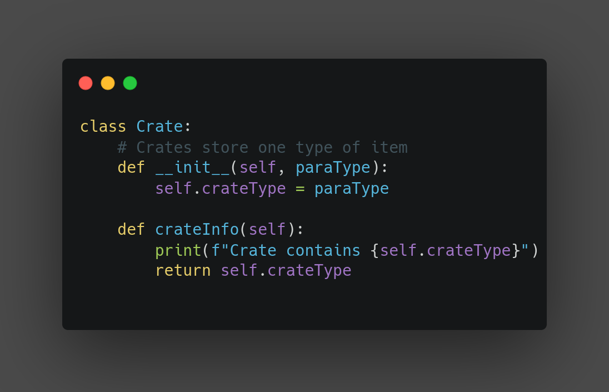

---

#### A Python program designed to make inventory management easier.

###### (this project was created for my second project week in the JustIT Boot Camp)

---

[Repl version can be found here](https://replit.com/@S-Riches/WarehouseManagement#main.py)

---

### Installation of files

To get the files, please go the branch called `slimVersion` as this doesn't include the README and clone it.

---

## How to use:

Firstly before booting up the program, you need to have a list of all the crates you want to store, for reference please look at the file named `Data.txt`. (please note there is no limit on how many items to be loaded in but performance may be hindered with large datasets.)

Simply rename your file to `Data.txt` and replace the existing file.

Now when you load the program, you will be prompted whether or not you wish to load in this file, select 'Y' to load it in.

After loading in the crate data or not, you will be presented with a menu that will allow you to choose between:

-   Inventory Ticket printer
-   Search capabilities to look for certain items
-   The Shipping feature
-   Exit

After selecting one of the options you will be given instructions on how to use this software.

After completing one of the options (besides exiting the program) you will be presented with the options again until you decide to close the program.

Dont worry about your data after closing the program, as the software is connected to a database and this will keep your information stored for the next time you boot up the program.

---

## How it was made

#### Technologies used :

-   Python
-   Sqlite 3

---

#### Code examples :

The program converts each line of the data file into a crate, and puts 12 crates into a container, the crate itself just stores its contents for later use within the code

The containers are built as a way to group the crates together, and remember where they are in the warehouse. They also store a memory of whats inside of them when created as to allow for simple information feedback to the user. I also decided to allow for counting of different crates by using pythons sets, which only allow for unique characters, then looping through the set and counting how many times each unique crate type appears.
.png>)

The Search feature is used within the search function and the shipping function. due to the persistent nature of the software, we use the database to find data as the data is cleared at run time from the classes. i reuse the code from the classes to count unique crate types in the the containers. this allows for an output similar to :

`3x coca colas in container x,
4x coca colas in container y`
.png>)

The ship items function simply works via a list that the user creates prior to calling the function, then we print out prior to running this function where to find the items in their containers. and finally we delete the items from the database, as long as the exist, and provide confirmation that the item has been shipped.
.png>)
